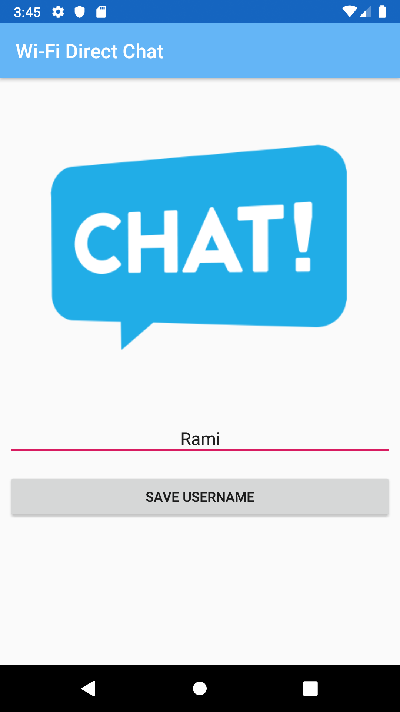
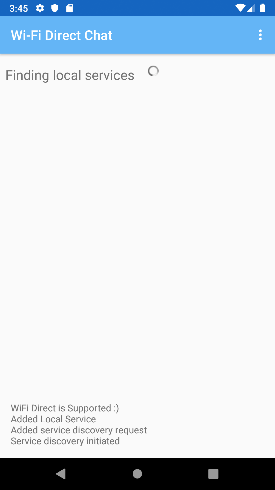

# Wi-Fi Direct Chat  - Android
A simple Android application that utilizes the Wi-Fi Direct (also known as peer-to-peer or P2P) service for local network chat.

## How to use
Just run the application and set a username, make sure Wi-Fi Direct is active and the app is installed on all devices that would use it for chat.

## Features
* Optional Username to set and chat
* Auto start and end of chat between peers based on mutual actions

 
